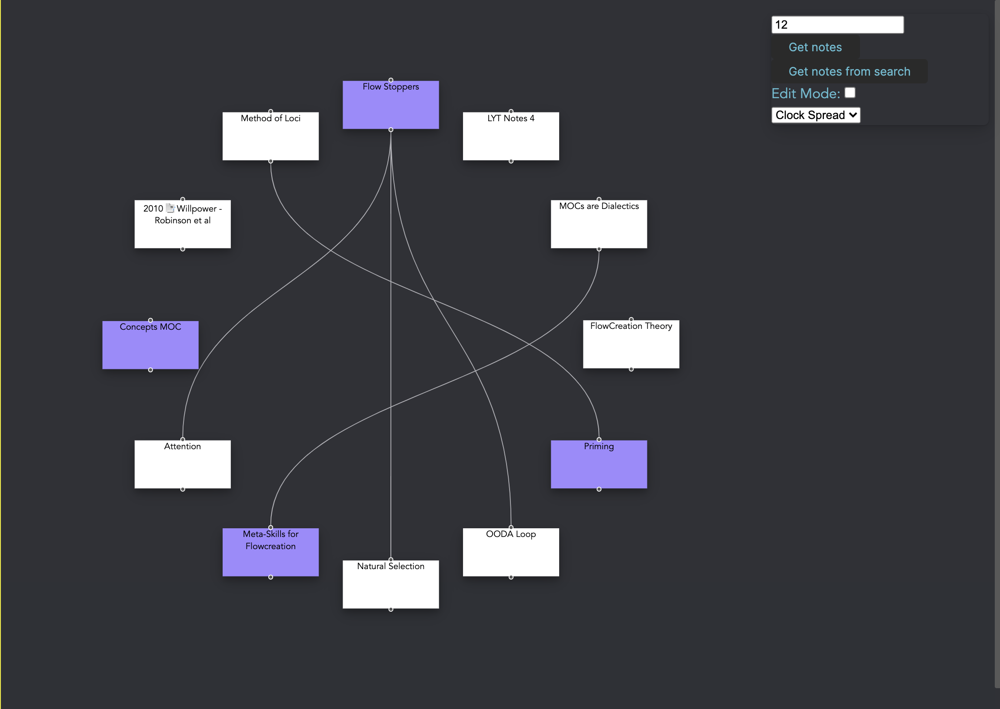

# Obsidian Corkboard

A visual canvas to work with your Obsidian notes

## Usage

Click 'Get Random Notes' or 'Get Random Notes from Search' to populate the canvas with random note cards.

Double click to create a new card.

Click a note to select it, shift+click to select multiple. Click either 'Get Random' button to replace your selection. They will replace the whole canvas if nothing is selected

Click the 'Edit Mode' checkbox to add an input to each note card. You can type to find a new note, then select it to replace the existing note on the card. Click 'Edit Mode' checkbox again to hide the inputs.

Click and drag from one handle (small black dot) on a card to another to create a link between cards (this is only on the Corkboard canvas, not in your notes themselves.)

This is in super early alpha, so please let me know about any bugs and suggestions.
